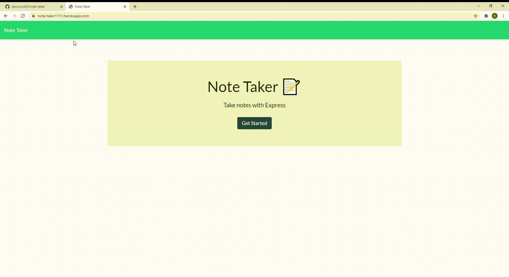

# Note Taker with Node.Express

license MIT
[]

## Description
It's a homework for using server side scripting with Express. Making a note taker app and hosting it on Heroku. Using JSON to emulate a database.

## Table of Contents 
    
* [installation](#installation)

* [run](#run)

* [heroku](#heroku)

* [usage](#usage)

* [license](#license)

* [contributing](#contributing)

* [tests](#tests)

* [questions](#questions)

## Installation

To install necessary dependencies, run the following command:

npm install

## Run 

To run program, type the following in git bash terminal. 

node server.js

## Heroku

The program is published on the following heroku link:

 https://note-taker1111.herokuapp.com/

## Usage

homework

## License

This project is licensed under the MIT license.

## Contributing

no

## Tests

To run tests, run the following command:

none

## Questions 

If you have any questions about the repo, open an issue or contact me directly at haoguan200@gmail.com. You can find more
of my work at devtown425.      
